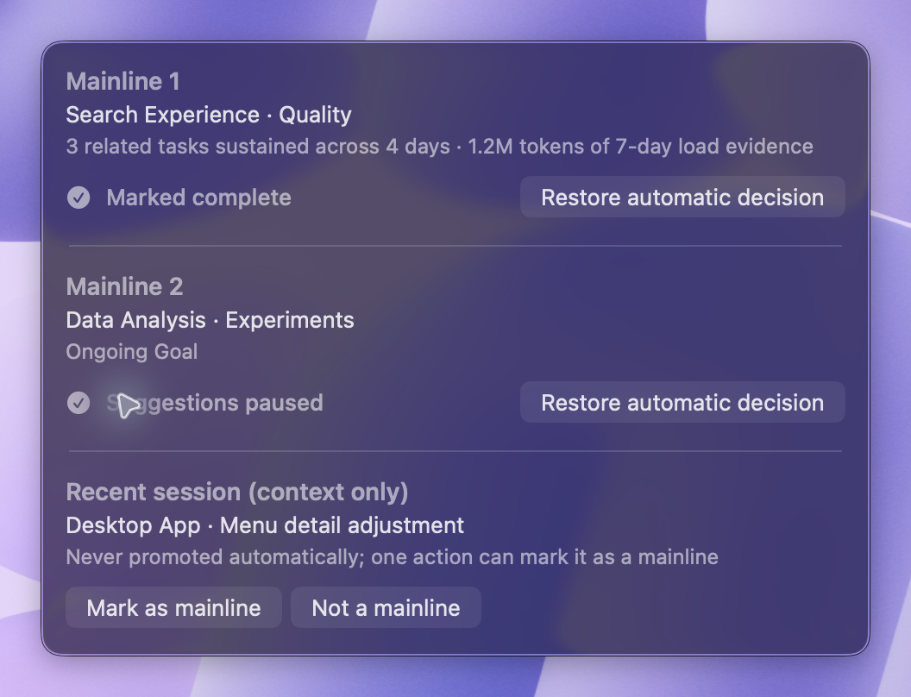
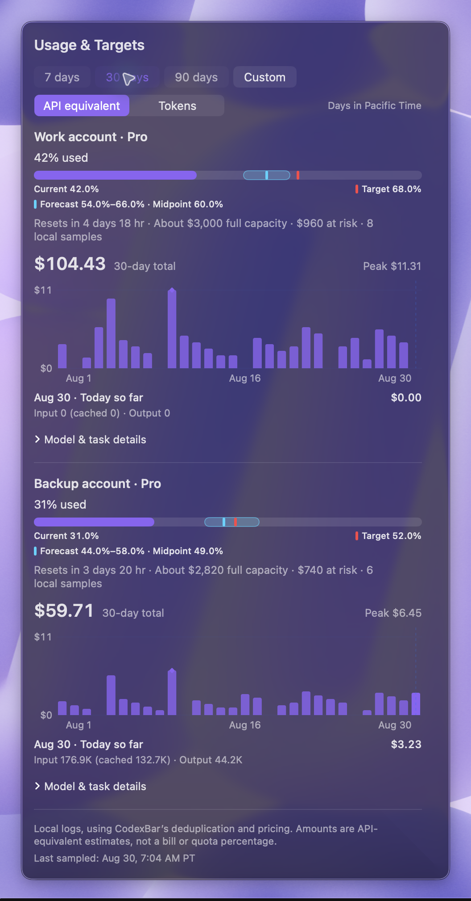
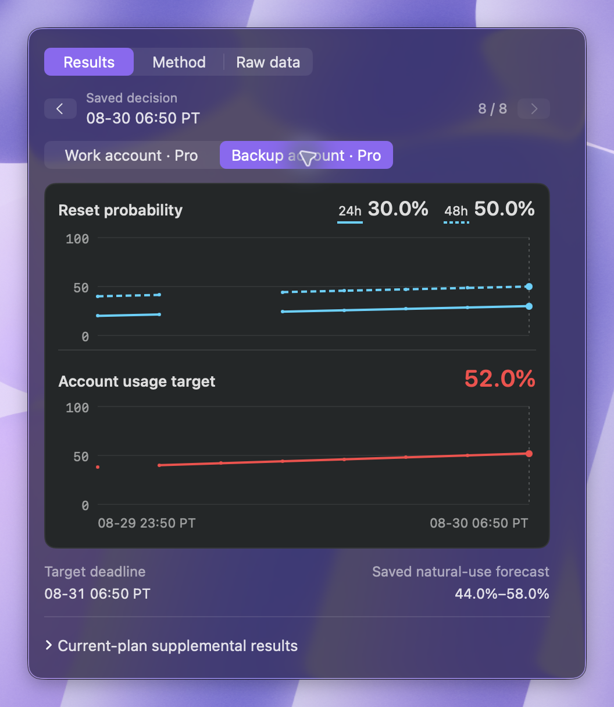
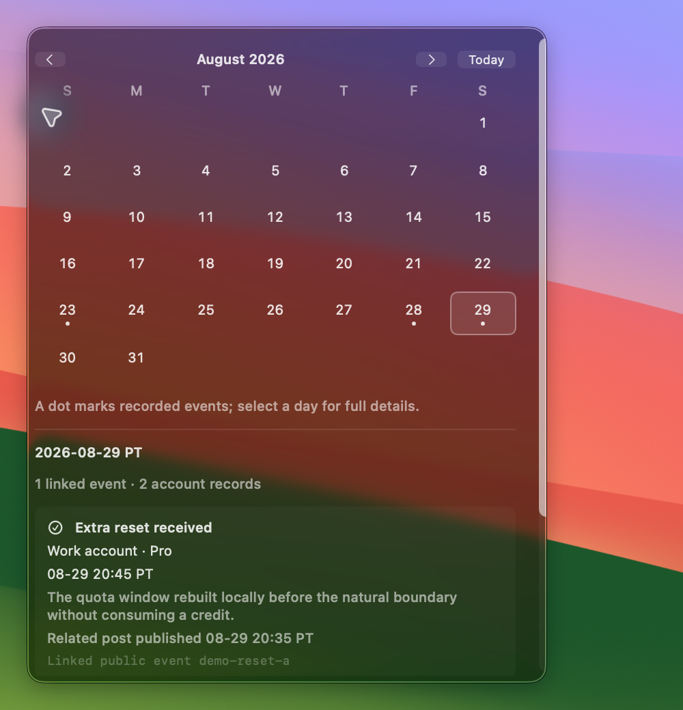

<p align="center">
  
</p>

<h1 align="center">Codex Capacity Planner</h1>

<p align="center"><strong>A local usage planner for Codex</strong></p>

<p align="center">
  It combines current quota, personal usage pace, recent work, reset information, and reset credits<br>
  to provide recommendations for work pace, account use and switching, and reset-credit timing.
</p>

<p align="center">
  Use more of each quota cycle and reduce the impact of running out of capacity while working.
</p>

<p align="center">
  <a href="https://github.com/Yusong-Enceladus/codex-capacity-planner/releases/latest/download/Codex-Capacity-Planner-macOS.dmg"><strong>Download the macOS DMG</strong></a>
  ·
  <a href="README.md">简体中文</a>
</p>

<p align="center">
  
</p>

> This is not an official OpenAI product and is not affiliated with or endorsed by OpenAI. Codex is a trademark of OpenAI.

## What it provides

- **Usage plan**: shows current usage, target usage, and expected usage, then recommends maintaining or increasing pace.
- **Recent-work suggestions**: puts up to 5/3/1 logical mainlines and correction actions directly in the main menu. Valid actions share one horizontal row; edits show inline feedback and keep the menu open for successive corrections or restoring automatic judgment. Explicit labels, Goals, and cross-day continuity determine intent; tokens describe load only, and temporary sessions never fill the list.
- **Reset management**: puts natural resets, possible-reset windows, official resets, plan upgrades, and observed delivery on one past→now→future timeline.
- **Multiple accounts**: “Usage & Targets” gives every visible account its own current, target, and forecast range while retaining API-equivalent capacity, expected loss, and local sampling provenance.
- **Daily usage history**: a bar chart sits directly beneath each account's progress bar. Shared 7/30/90-day controls default to 30 days, remember the selection, and support custom 1–365-day ranges. Inspect API-equivalent estimates or tokens, totals, peak days and selected-day details; models, projects and tasks start collapsed, and interactions keep the menu open.
- **Explainable calculations**: “Calculation & Data” is an independent first-level entry with in-page Results, Method, and Raw Data controls. Key values and aligned trends share one observation and account; formulas, complete records, and live diagnostics expand in clearly separate sections.
- **Reset-credit planning**: shows every credit with its owning account and individual expiry on one shared axis from “Now,” so more remaining time always means a longer line. It also visualizes net capacity, API-equivalent value, the high-value window, and both “free reset happens” and “no free reset happens” outcomes.

<p align="center">
  
</p>

<p align="center"><sub>Mark complete, then snooze another mainline without reopening the menu. Other actions and Restore automatic decision remain available.</sub></p>

<p align="center">
  
</p>

Historical amounts estimate the API equivalent of local logs, not bills or quota percentages. Chinese groups events into UTC+8 days; English uses Pacific Time. Resets never erase consumed usage. Older logs without reliable account evidence appear under Unassigned local usage, never guessed from the current login or duplicated across accounts. Gaps are not zero usage, and selecting 365 days does not promise 365 days of reliable records.

History directly reuses CodexBar's deduplication and pricing, including inherited fork prefixes, Fast and long contexts. Version 0.1.11 corrects earlier duplicate counts and price differences automatically; initial indexing shows progress and preserves account and reset records. Compare with CodexBar using the same date range, calendar time zone and sampling time.

<p align="center">
  
</p>

<p align="center"><sub>Screenshots come from the built macOS menu-bar app running with anonymous demo data; no real account information is included.</sub></p>

<details>
<summary><strong>Inspect message effects and reset history</strong></summary>

<p align="center"></p>
<p align="center"></p>

Each historical point is a decision saved at that time; missing past predictions are never backfilled. These anonymous synthetic scenarios use the production native interface.

Menus measure their actual content before opening, so short timelines and explanations leave no oversized blank panel. Expanded details scroll in place without closing the menu. Both historical plots share a time axis and selection; Chinese uses UTC+8 and English uses Pacific Time.

Results, Method, Raw Data and the calculation account selector now use the same native segmented controls as Usage & Targets. Mainline text and buttons are larger; actions still share one row and saved feedback does not move neighbouring mainlines.

</details>

## One unified usage plan

Current quota, usage, recent work, reset information, and reset credits form one plan. When any input changes, work, account, and reset-credit recommendations update together.

## Standalone app and CodexBar

The macOS app works independently. When using the CodexBar integration included in the source tree, both interfaces read the same local plan and recommendations.

The app starts and connects its bundled local component automatically, including taking over a stale bundled component after an upgrade; users never configure a service URL. Suggested Mainlines, Usage & Targets, Resets, Why This Plan, and Calculation & Data stay directly above Refresh, Settings, and Quit in the main menu.

## Install

1. Download [`Codex-Capacity-Planner-macOS.dmg`](https://github.com/Yusong-Enceladus/codex-capacity-planner/releases/latest/download/Codex-Capacity-Planner-macOS.dmg).
2. Open the DMG and drag `Codex Capacity Planner` onto the Applications shortcut in the same window.
3. On first launch, open Applications, Control-click the app, and choose Open. If macOS still blocks it, open System Settings → Privacy & Security, verify the app name, and choose Open Anyway.

The current download supports Apple Silicon and bundles Node.js, the local monitor, and collection helpers; CodexBar, a separate Node.js installation, and local-service configuration are not required. The release also keeps an equivalent ZIP and `SHA256SUMS.txt`. Because this repository currently has no Apple Developer ID, the community build is ad-hoc signed and not notarized, so the one-time system confirmation above remains necessary.

<details>
<summary><strong>Build from source</strong></summary>

Requires macOS 14 or later, Xcode / Swift 6.2, and Node.js 22:

```sh
git clone https://github.com/Yusong-Enceladus/codex-capacity-planner.git
cd codex-capacity-planner
./CodexResetApp/build-app.sh
open "CodexResetApp/dist/Codex Capacity Planner.app"
```

Intel users can build the matching architecture from source.

</details>

## Privacy

Quota, account, reset time, predictions, and task information are processed locally. Mainline inference reads task titles and bounded first-message/preview excerpts locally and immediately reduces them to topic features; the original excerpts are not retained in planner state or exposed by its local API. The planner does not read response text, source code, tool output, authentication tokens, or browser cookies.

External reset-signal requests do not include account identifiers, email addresses, quota, personal reset times, task information, or recommendations. The default signal source, `codex-reset.com`, is an independent third-party service not operated by this project. If unavailable, planning continues from local quota, natural-reset, and personal-usage information.

See [Privacy and data flow](docs/privacy.md) and the [Security policy](SECURITY.md).

## Current support

- Prebuilt downloads support Apple Silicon and macOS 14 or later.
- Recommendations remain advisory; the planner does not run tasks, switch accounts, or use reset credits automatically.
- Ordinary reset forecasts remain probabilistic; explicit announcements and delivery to the current account are shown separately.
- Public signal tiers, scores, and deadlines come from [codex-reset.com](https://codex-reset.com/forecast-method). Cadence probabilities stay separate from commitment weights; delivery of an earlier reset cannot erase a different future promise. A latest-time boundary is shown as “by,” not an exact arrival time.
- Evidence for a possible reset is never presented as a probability. The reset timeline runs from past to present to future, and places “Now” inside a possible-reset window when applicable. Chinese uses UTC+8; English uses Pacific Time.
- Reset-credit advice checks every account and evaluates both “a free reset happens” and “no free reset happens.” It cannot recommend immediate redemption while account usage is unconfirmed or another account still has usable capacity.
- When one account owns multiple reset credits, each credit retains its own grant and expiry rather than borrowing the inventory's earliest expiry.
- The reset-credit visualization shows remaining time from now to expiry, not elapsed lifecycle percentage. All visible credits share one scale, so a later expiry always produces a longer line.
- Home-card content wraps to show complete recommendations, dates, and time zones instead of truncating them with ellipses.
- Inspect received evidence, its interpretation, per-account plans, and actual delivery. Unchanged plans have an explanation too; public-input comparisons fix time and account data rather than attributing elapsed time to a message.
- Results, Method, and Raw Data are in-page controls. Cadence probabilities, signal weights, and usage targets remain separate. A calendar opens detailed receipt rows without counting a shared public event twice.
- Decision history remains local and starts with real observations. Source failures create gaps, not zero probabilities. WillCodexReset is a product reference only and is not an automatically integrated source.
- Changes to Codex quota rules may require updates to the calculations.

## Technical documentation

- [Architecture and decision boundaries](docs/architecture.md)
- [Capacity baselines and personal calibration](docs/capacity-baselines.md)
- [External signal contract](docs/signal-contract.md)
- [Inspectable decisions and history](docs/decision-history.md)
- [macOS distribution and installation boundary](docs/distribution.md)
- [Contributing](CONTRIBUTING.md)

The project is open source under the [MIT License](LICENSE). See [NOTICE](NOTICE) for third-party code and licenses.
