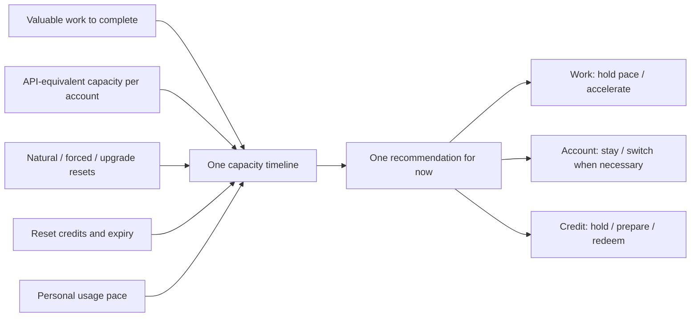

# Codex Capacity Planner

[简体中文](README.md) · [Download the latest release](https://github.com/Yusong-Enceladus/codex-capacity-planner/releases/latest)

> **Do not run out of Codex capacity when valuable work needs it—and do not let capacity disappear unused at the next reset.**

Codex Capacity Planner is a local macOS menu-bar app. It puts your **real work demand, the effective capacity of each account, personal usage pace, every event that may replenish capacity, and banked reset credits** on one timeline. It then answers one question:

> **What should I do now to complete more valuable work?**

The answer may be to keep your current pace, bring forward existing tasks, wait for a free reset, switch to a named account only when it materially helps, or hold / redeem a reset credit.

**This is not a multi-account quota merger.** Every account keeps its own quota, reset cycle, and reset-credit inventory. The planner never adds percentages across accounts or shows two accounts' credits as “2 available” on the current account. If you have one account, the multi-account branch simply disappears.

> This is not an official OpenAI product and is not affiliated with or endorsed by OpenAI. Codex is a trademark of OpenAI.

## Why “29% remaining” is not a decision

A quota percentage is a fact, not an action. A useful decision also needs to know:

- how much API-equivalent work that 29% represents—29% of a `5x` plan and 29% of a `20x` plan are not the same capacity;
- how much you are likely to use before the next reset at your personal pace;
- whether the next replenishment is a natural reset, an explicitly announced forced reset, a plan upgrade, or a credit you must choose to redeem;
- whether unused capacity will disappear at that replenishment;
- whether you already have valuable work worth running;
- for multiple accounts, which account has real capacity at risk sooner—not which percentage merely looks larger.

Looking at these inputs separately produces misleading advice. Codex Capacity Planner orders them on **one capacity chain** and compares how much real work each possible action can serve.



Work, account, and reset-credit actions are three projections of one plan—not three independent rule sets.

## The example that explains the product

Suppose the current account still has capacity and holds one reset credit. An official announcement says a forced reset will arrive in about 12 hours.

Redeeming merely because a credit is available would be the wrong decision. The free reset 12 hours later could overwrite the newly created capacity, destroying most of the credit's value.

The correct plan is:

1. Treat the explicit forced reset as the next free replenishment.
2. Before it arrives, use capacity that would otherwise disappear on already-existing valuable work.
3. Hold the reset credit and recompute the entire chain after the reset lands locally.
4. Form a high-value redemption node only when all usable accounts will be exhausted, no earlier free reset is nearby, and real work still needs capacity.

Conversely, if all available capacity is exhausted immediately after a new cycle begins and the next natural reset is still far away, a credit may add almost one full cycle of net capacity. A **reset credit is therefore an expiring capacity option, not a coupon that becomes automatically better to use near expiry**.

## What you see

The home view leads with the conclusion:

- **what to do now**: maintain pace, continue existing tasks, accelerate, or switch to a named account only when real capacity is at risk;
- **near-term plan**: current usage, the target line, and your forecast natural-usage range at the same horizon;
- **real tasks worth continuing**: up to five recent tasks directly on the home view when additional work is useful;
- **reset action**: wait for delivery, hold a credit, prepare a high-value node, or redeem.

Details have only three destinations:

- **Account**: the active account and independently measured capacity that matters for multi-account users;
- **Why this recommendation**: where usage pace came from, how the forecast was formed, the target gap, and which evidence changed the decision;
- **Resets**: natural resets, explicit forced resets, plan upgrades, reset credits, official source posts, and recent reset history in one place.

The standalone app and the CodexBar integration read the same local decision snapshot. They may use different information density, but they cannot reach different conclusions.

## How the decision is made

### 1. Establish facts before inference

The planner reads the active account, quota window, plan, reset-credit inventory, personal usage history, and limited task metadata locally. Public signals are used only for official announcements and probabilistic reset risk.

“A reset was announced” and “my account received it” are different states. Delivery is confirmed only after the local quota window actually rebuilds.

Reset attribution follows evidence:

- credit inventory decreases while the quota window rebuilds: reset-credit redemption;
- paid plan genuinely increases while the window rebuilds: plan-upgrade reset;
- the established weekly boundary is reached before rebuild: natural reset;
- the full window rebuilds early without a credit or upgrade: forced reset.

A same-tier renewal, or restoring the same plan from Free before the old cooldown ends, is not misclassified as an upgrade reset.

### 2. Convert percentages into comparable work capacity

The planner does not multiply the marketing labels `5x / 20x`. Cold start uses dated community estimates of API-equivalent capacity. Once enough reliable personal samples exist, the local measured estimate takes over.

This lets the planner compare real capacity at risk before the next free reset and detect when an account's effective capacity is unusually low against its own history or the community range—without guessing provider intent.

### 3. Forecast how real work consumes capacity

The personal model uses only local history to estimate how much capacity your current pace will consume by the same deadline. When history is insufficient, it degrades explicitly instead of presenting false precision.

When more work should be brought forward, the planner lists recent, unarchived tasks that may be worth continuing. It does not read conversation bodies, invent busywork, or start a task automatically.

### 4. Simulate consumption and every replenishment on one timeline

Natural resets, explicit forced resets, probabilistic risk, plan upgrades, credit expiry, the new weekly cycle created by redemption, and each account's independent capacity are processed by one time-ordered simulation.

Hard boundaries include:

- an explicit non-credit reset within 24 hours invalidates pre-reset credit candidates;
- a credit becomes eligible only after every usable account's existing capacity is effectively exhausted;
- the planner must arrange existing valuable work to form a useful node before expiry—it may not silently accept expiry or manufacture work;
- account switching appears only when the current account is blocked, or another account has materially more API-equivalent capacity about to disappear at an earlier free reset; a few minutes spent signing in is not treated as a work interruption;
- recommendations are advisory: the app never switches accounts, redeems a credit, or operates a task.

See [Architecture and decision model](docs/architecture.md) for state boundaries and [Capacity baselines](docs/capacity-baselines.md) for community priors and local takeover rules.

## Install

### Download the macOS app

Download `Codex-Capacity-Planner-macOS.zip` from [GitHub Releases](https://github.com/Yusong-Enceladus/codex-capacity-planner/releases/latest), unzip it, and move the app to Applications.

The current download:

- supports Apple Silicon (arm64) Macs;
- bundles the Node.js runtime required by the monitor;
- uses an ad-hoc signature and is not notarized with an Apple Developer ID.

If macOS blocks the first launch, Control-click the app in Finder and choose Open, or use System Settings → Privacy & Security → Open Anyway. Intel users can build the matching architecture from source.

### Build from source

Requires macOS 14 or later, Xcode / Swift 6.2, and Node.js 22:

```sh
git clone https://github.com/Yusong-Enceladus/codex-capacity-planner.git
cd codex-capacity-planner
./CodexResetApp/build-app.sh
open "CodexResetApp/dist/Codex Capacity Planner.app"
```

The standalone app includes the local monitor and quota helper, so CodexBar does not need to remain running. If the CodexBar integration is installed, both surfaces reuse the same monitor on `127.0.0.1:18765`.

## Privacy boundary

Decisions happen on your Mac; personal work data is not uploaded to an analytics service.

Quota, account, reset time, predictions, task titles, and project basenames stay local. The planner does not need prompt or response text, source code, tool output, full project paths, authentication tokens, or browser cookies.

Routine requests to the external signal service do not carry account identifiers, email addresses, quota values, personal reset times, task metadata, or recommendations. Enabling Web Push sends only the browser-created push endpoint and language; the local capability token never leaves loopback.

The default external signal source is `codex-reset.com`, an independent third-party service not operated by this project or its maintainer. If unavailable, the planner falls back to local natural-reset and personal-usage planning.

See [Privacy and data flow](docs/privacy.md) and the [Security policy](SECURITY.md) for retention, interfaces, and safe issue reporting.

## Current boundaries

- API-equivalent capacity is a planning estimate, not an OpenAI-promised account balance.
- Ordinary reset forecasts remain probabilistic; only verifiable explicit announcements become deterministic events.
- The project cannot trigger a server-side reset and never performs work, account switching, or credit redemption for you.
- Prebuilt downloads are currently Apple Silicon only and are not Apple-notarized.
- The model currently targets Codex weekly quota behavior and may need updates when provider rules change.

## Develop and contribute

Core paths:

- `codex-reset.js`: normalization, capacity chain, attribution, and the shared decision snapshot;
- `codex-reset-monitor.js`: local state machine, notifications, signal sync, and loopback API;
- `codex-reset-behavior.js`: personal longer-horizon usage forecast;
- `codex-reset-short-load.js`: independent one-hour load forecast;
- `CodexResetApp/`: native macOS menu-bar app;
- `patches/codexbar/`: reviewable integration patch against a pinned CodexBar upstream version.

Before submitting a change:

```sh
./scripts/check-public-tree.sh
./scripts/scan-public-content.sh
node codex-reset.test.js
swift test --package-path CodexResetApp
```

Focused bug fixes, synthetic tests, connector hardening, accessibility work, and evidence-backed decision-model changes are welcome. Do not attach real-account screenshots, auth files, local databases, quota history, or private task names to issues. See [Contributing](CONTRIBUTING.md).

## License and third-party code

The project is open source under the [MIT License](LICENSE). The CodexBar integration targets a pinned MIT-licensed upstream version and is stored as patches under `patches/codexbar/`; the full worktree is generated at build time. See [NOTICE](NOTICE) for third-party notices.
