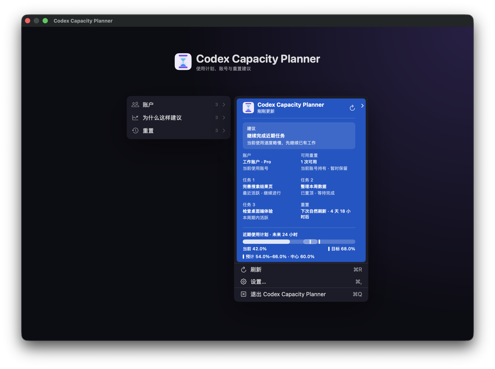
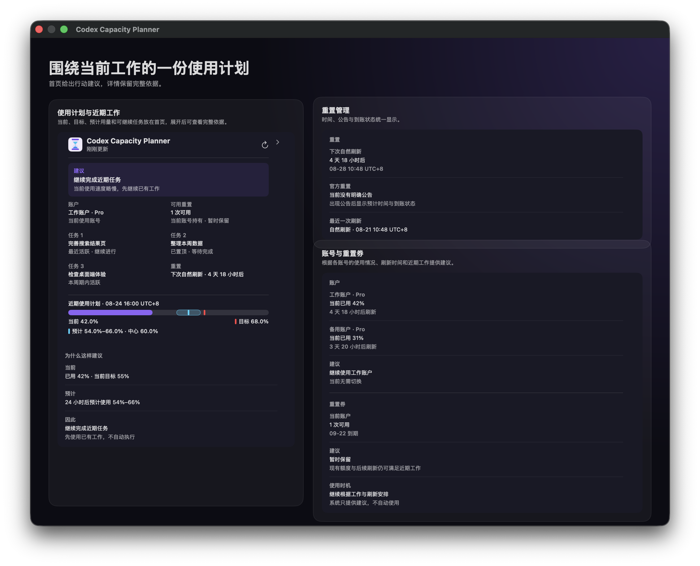
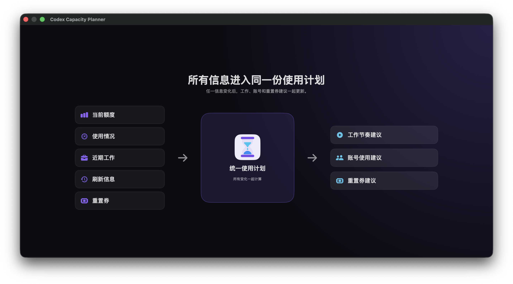
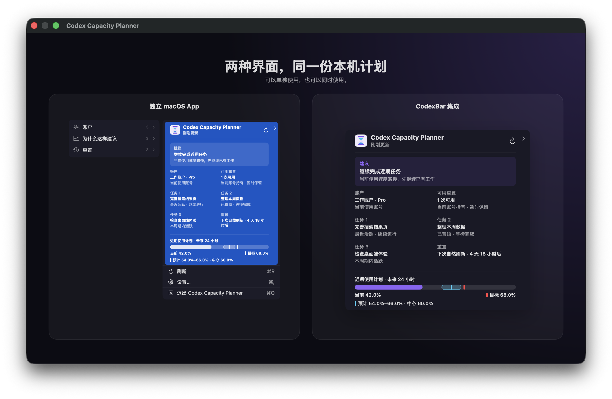

<p align="center">
  
</p>

<h1 align="center">Codex Capacity Planner</h1>

<p align="center"><strong>A local usage planner for Codex</strong></p>

<p align="center">
  It combines current quota, personal usage pace, recent work, reset information, and reset credits<br>
  to provide recommendations for work pace, account use and switching, and reset-credit timing.
</p>

<p align="center">
  Use more of each quota cycle and reduce the impact of running out of capacity while working.
</p>

<p align="center">
  <a href="https://github.com/Yusong-Enceladus/codex-capacity-planner/releases/latest"><strong>Download for macOS</strong></a>
  ·
  <a href="README.md">简体中文</a>
</p>



> This is not an official OpenAI product and is not affiliated with or endorsed by OpenAI. Codex is a trademark of OpenAI.

## What it provides

- **Usage plan**: shows current usage, target usage, and expected usage, then recommends maintaining or increasing pace.
- **Recent-work suggestions**: lists 3–5 recent tasks on the home view when additional usage would be useful.
- **Reset management**: keeps natural resets, official resets, plan upgrades, reset credits, and account delivery status together.
- **Multiple accounts**: uses each account's available quota, usage, and reset timing to recommend account use and switching.
- **Reset-credit planning**: combines existing quota, future resets, and work demand to recommend holding, preparing, or using a credit.



## One unified usage plan

Current quota, usage, recent work, reset information, and reset credits form one plan. When any input changes, work, account, and reset-credit recommendations update together.



## Standalone app and CodexBar

The macOS app works independently. When using the CodexBar integration included in the source tree, both interfaces read the same local plan and recommendations.



## Install

Download `Codex-Capacity-Planner-macOS.zip` from [GitHub Releases](https://github.com/Yusong-Enceladus/codex-capacity-planner/releases/latest), unzip it, and move the app to Applications.

The current download supports Apple Silicon and bundles its required runtime. It uses an ad-hoc signature and is not Apple-notarized. If macOS blocks the first launch, Control-click the app in Finder and choose Open, or use System Settings → Privacy & Security → Open Anyway.

<details>
<summary><strong>Build from source</strong></summary>

Requires macOS 14 or later, Xcode / Swift 6.2, and Node.js 22:

```sh
git clone https://github.com/Yusong-Enceladus/codex-capacity-planner.git
cd codex-capacity-planner
./CodexResetApp/build-app.sh
open "CodexResetApp/dist/Codex Capacity Planner.app"
```

Intel users can build the matching architecture from source.

</details>

## Privacy

Quota, account, reset time, predictions, and task information are processed locally. The planner does not need prompt or response text, source code, tool output, authentication tokens, or browser cookies.

External reset-signal requests do not include account identifiers, email addresses, quota, personal reset times, task information, or recommendations. The default signal source, `codex-reset.com`, is an independent third-party service not operated by this project. If unavailable, planning continues from local quota, natural-reset, and personal-usage information.

See [Privacy and data flow](docs/privacy.md) and the [Security policy](SECURITY.md).

## Current support

- Prebuilt downloads support Apple Silicon and macOS 14 or later.
- Recommendations remain advisory; the planner does not run tasks, switch accounts, or use reset credits automatically.
- Ordinary reset forecasts remain probabilistic; explicit announcements and delivery to the current account are shown separately.
- Changes to Codex quota rules may require updates to the calculations.

## Technical documentation

- [Architecture and decision boundaries](docs/architecture.md)
- [Capacity baselines and personal calibration](docs/capacity-baselines.md)
- [External signal contract](docs/signal-contract.md)
- [Contributing](CONTRIBUTING.md)

The project is open source under the [MIT License](LICENSE). See [NOTICE](NOTICE) for third-party code and licenses.
