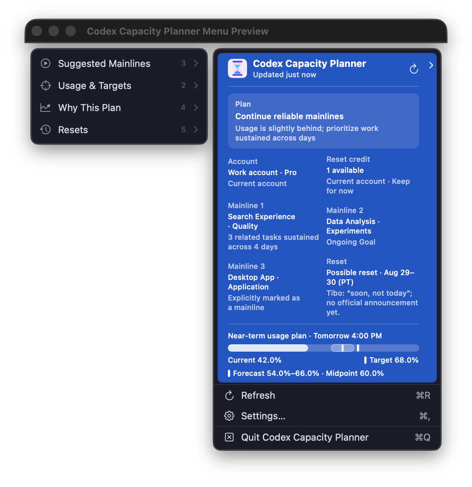
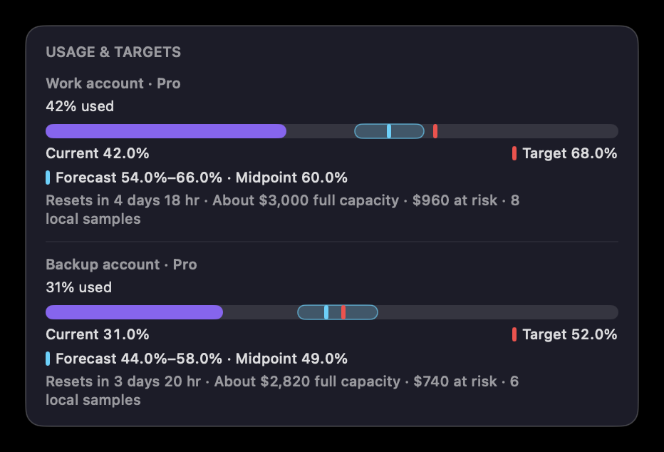
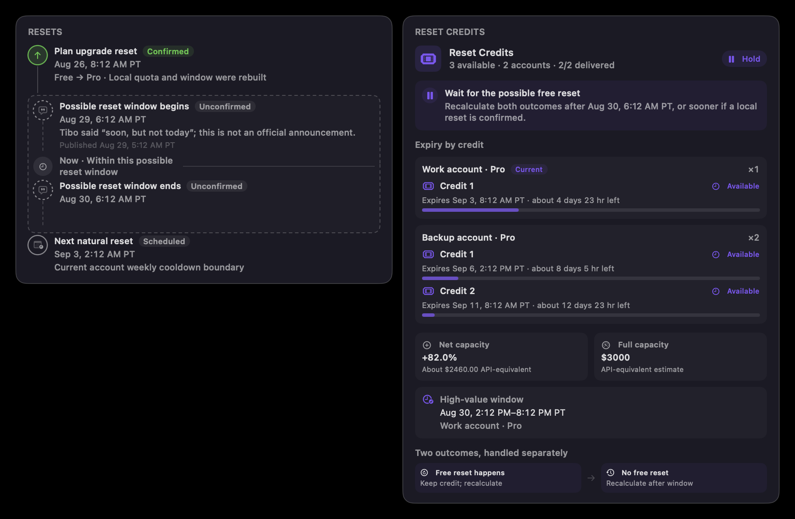

<p align="center">
  
</p>

<h1 align="center">Codex Capacity Planner</h1>

<p align="center"><strong>A local usage planner for Codex</strong></p>

<p align="center">
  It combines current quota, personal usage pace, recent work, reset information, and reset credits<br>
  to provide recommendations for work pace, account use and switching, and reset-credit timing.
</p>

<p align="center">
  Use more of each quota cycle and reduce the impact of running out of capacity while working.
</p>

<p align="center">
  <a href="https://github.com/Yusong-Enceladus/codex-capacity-planner/releases/latest"><strong>Download for macOS</strong></a>
  ·
  <a href="README.md">简体中文</a>
</p>

<p align="center">
  
</p>

> This is not an official OpenAI product and is not affiliated with or endorsed by OpenAI. Codex is a trademark of OpenAI.

## What it provides

- **Usage plan**: shows current usage, target usage, and expected usage, then recommends maintaining or increasing pace.
- **Recent-work suggestions**: puts up to 5/3/1 logical mainlines and correction actions directly in the first-level menu. Explicit labels, Goals, and cross-day continuity determine intent; tokens describe load only, and temporary sessions never fill the list.
- **Reset management**: puts natural resets, possible-reset windows, official resets, plan upgrades, and observed delivery on one past→now→future timeline.
- **Multiple accounts**: “Usage & Targets” gives every visible account its own current, target, and forecast range while retaining API-equivalent capacity, expected loss, and local sampling provenance.
- **Explainable calculations**: “Calculation & Data” separates results, method, and raw inputs instead of mixing account state, formulas, and diagnostics.
- **Reset-credit planning**: shows every credit with its owning account and individual expiry, then visualizes net capacity, API-equivalent value, the high-value window, and both “free reset happens” and “no free reset happens” outcomes.

<p align="center">
  
</p>

<p align="center">
  
</p>

<p align="center"><sub>Screenshots use the current production components with anonymous demo data; no real account information is included.</sub></p>

## One unified usage plan

Current quota, usage, recent work, reset information, and reset credits form one plan. When any input changes, work, account, and reset-credit recommendations update together.

## Standalone app and CodexBar

The macOS app works independently. When using the CodexBar integration included in the source tree, both interfaces read the same local plan and recommendations.

## Install

Download `Codex-Capacity-Planner-macOS.zip` from [GitHub Releases](https://github.com/Yusong-Enceladus/codex-capacity-planner/releases/latest), unzip it, and move the app to Applications.

The current download supports Apple Silicon and bundles its required runtime. It uses an ad-hoc signature and is not Apple-notarized. If macOS blocks the first launch, Control-click the app in Finder and choose Open, or use System Settings → Privacy & Security → Open Anyway.

<details>
<summary><strong>Build from source</strong></summary>

Requires macOS 14 or later, Xcode / Swift 6.2, and Node.js 22:

```sh
git clone https://github.com/Yusong-Enceladus/codex-capacity-planner.git
cd codex-capacity-planner
./CodexResetApp/build-app.sh
open "CodexResetApp/dist/Codex Capacity Planner.app"
```

Intel users can build the matching architecture from source.

</details>

## Privacy

Quota, account, reset time, predictions, and task information are processed locally. Mainline inference reads task titles and bounded first-message/preview excerpts locally and immediately reduces them to topic features; the original excerpts are not retained in planner state or exposed by its local API. The planner does not read response text, source code, tool output, authentication tokens, or browser cookies.

External reset-signal requests do not include account identifiers, email addresses, quota, personal reset times, task information, or recommendations. The default signal source, `codex-reset.com`, is an independent third-party service not operated by this project. If unavailable, planning continues from local quota, natural-reset, and personal-usage information.

See [Privacy and data flow](docs/privacy.md) and the [Security policy](SECURITY.md).

## Current support

- Prebuilt downloads support Apple Silicon and macOS 14 or later.
- Recommendations remain advisory; the planner does not run tasks, switch accounts, or use reset credits automatically.
- Ordinary reset forecasts remain probabilistic; explicit announcements and delivery to the current account are shown separately.
- Evidence for a possible reset is never presented as a probability. The reset timeline runs from past to present to future, and places “Now” inside a possible-reset window when applicable. Chinese uses UTC+8; English uses Pacific Time.
- Reset-credit advice checks every account and evaluates both “a free reset happens” and “no free reset happens.” It cannot recommend immediate redemption while account usage is unconfirmed or another account still has usable capacity.
- When one account owns multiple reset credits, each credit retains its own grant and expiry rather than borrowing the inventory's earliest expiry.
- Home-card content wraps to show complete recommendations, dates, and time zones instead of truncating them with ellipses.
- Changes to Codex quota rules may require updates to the calculations.

## Technical documentation

- [Architecture and decision boundaries](docs/architecture.md)
- [Capacity baselines and personal calibration](docs/capacity-baselines.md)
- [External signal contract](docs/signal-contract.md)
- [Contributing](CONTRIBUTING.md)

The project is open source under the [MIT License](LICENSE). See [NOTICE](NOTICE) for third-party code and licenses.
