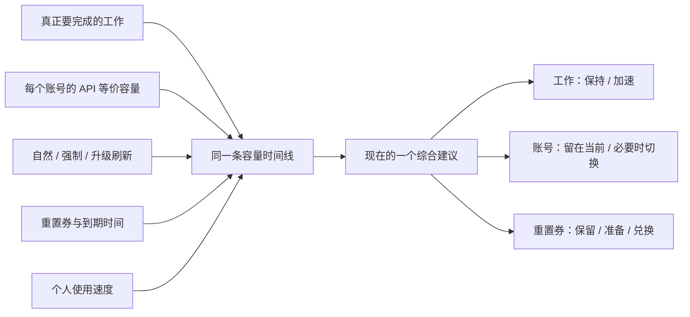

# Codex Capacity Planner

[English](README.en.md) · [下载最新版](https://github.com/Yusong-Enceladus/codex-capacity-planner/releases/latest)

> **别让 Codex 额度在真正需要工作时耗尽，也别让即将刷新的额度白白作废。**

Codex Capacity Planner 是一个本地运行的 macOS 菜单栏应用。它把**真实工作需求、每个账号实际可用的工作容量、个人使用速度、所有可能补充容量的事件，以及重置券**放进同一条时间线，然后只回答一个问题：

> **为了完成更多真正有价值的工作，我现在最应该做什么？**

答案可能是保持当前节奏、提前多跑几个已有任务、等待一次免费刷新、在确有必要时切到某个账号，或者继续保留 / 使用一张重置券。

**它不是多账号额度合并器。** 每个账号的额度、刷新周期和重置券始终独立；系统不会把两个账号的百分比相加，也不会把两个账号各自的一张券显示成当前账号“2 次可用”。只有一个账号时，多账号调度逻辑完全不出现。

> 非 OpenAI 官方产品。本项目与 OpenAI 没有隶属或背书关系；Codex 是 OpenAI 的商标。

## 为什么只看“还剩 29%”不够

额度百分比是一个事实，但不是一个决定。真正影响下一步行动的是：

- 这 29% 对应多少真实的 API 等价工作容量；`5x` 的 29% 和 `20x` 的 29% 不是同一件事；
- 按照个人最近的使用速度，在下一次刷新前会自然用掉多少；
- 下一次容量补充来自自然刷新、官方明确强制刷新、套餐升级，还是一张需要主动兑换的券；
- 现有容量会不会在免费刷新时被清零；
- 接下来是否有已经存在、值得完成的工作；
- 如果有多个账号，哪个账号的容量更早面临作废，而不是哪个账号的百分比看起来更大。

这些变量分开看都会产生误导。Codex Capacity Planner 的核心不是“显示更多数据”，而是把它们按时间先后放进**同一条容量链**，比较不同选择最终能承接多少真实工作。



工作、账号和重置券不是三套各自为政的规则，而是同一个计划的三个动作面。

## 一个最能说明问题的例子

假设当前账号还有容量，并持有一张重置券；官方同时宣布大约 12 小时后会进行一次强制刷新。

错误的做法是因为“券可用”就建议兑换。12 小时后免费刷新会覆盖刚换来的容量，券的价值几乎被浪费。

正确的计划是：

1. 把 12 小时后的明确强制刷新作为下一次免费容量补充；
2. 在刷新前，把当前仍会被清零的容量用于已经存在的有价值任务；
3. 重置券继续保留，刷新到账后重算整条容量链；
4. 只有当所有可用账号都将耗尽、附近没有更早的免费刷新，而且后面确实有真实工作需要承接时，才形成高价值兑换节点。

反过来，如果一个新周期刚开始就把所有可用容量耗尽，此后离自然刷新还很远，这时兑换一张券可能接近净增一整条周期容量。这也是为什么**重置券是一张有到期日的容量期权，不是“越临期越该用”的优惠券**。

## 你实际会看到什么

首页先给结论，不要求用户自己拼图：

- **现在做什么**：保持、继续已有任务、加速，或在确有容量风险时切换到具名账号；
- **近期使用计划**：当前用量、目标红线，以及按个人历史推算的自然使用区间；
- **可继续的真实任务**：需要增加工作时，在首页直接列出最多 5 个近期任务，而不是把建议藏在深层页面；
- **重置动作**：等待到账、保留重置券、准备高价值节点或兑换。

详情只有三个入口：

- **账户**：当前账号，以及多账号用户真正需要比较的独立容量；
- **为什么这样建议**：使用速度从哪里来、预测怎样得到、离目标还差多少、哪些事实改变了结论；
- **重置**：自然刷新、明确强制刷新、套餐升级、重置券、官方原帖与最近历史统一在一处。

独立 App 与 CodexBar 集成读取同一份本机决策快照。两边可以有不同的信息密度，但不会给出不同结论。

## 系统怎样作出决定

### 1. 先建立事实，不把推测写成事实

系统在本机读取当前账号、额度窗口、套餐、重置券库存、个人用量历史和有限的任务元数据。公开信号只用于识别官方公告或概率风险。

“官方宣布了刷新”和“你的账号已经到账”是两件事。系统只有观察到本机额度窗口真实重建，才确认个人到账。

刷新原因按证据区分：

- 券库存减少且额度窗口重建：重置券兑换；
- 付费档位真实上升且窗口重建：套餐升级刷新；
- 到达原有周周期边界后重建：自然刷新；
- 没有用券、没有升级，却提前完整重建：强制刷新。

同档续费，以及订阅掉到 Free 后在旧冷却期结束前恢复原档，都不会被误判为升级刷新。

### 2. 把百分比换成可比较的工作容量

系统不拿套餐页面上的 `5x / 20x` 标签直接做乘法。冷启动时采用有日期和来源的社区 API 等价经验值；积累到足够可靠的个人样本后，自动切换到本机实测容量。

因此它可以比较不同账号在下一次免费刷新前可能损失的真实容量，也能提示某个账号的有效容量是否明显低于自己的历史或社区区间，但不会猜测服务商的主观原因。

### 3. 预测真实工作会怎样消耗容量

个人模型只用本机历史估计：按照当前节奏，到同一个截止时点自然会用掉多少。历史不足时会明确降级，不显示伪精确结论。

需要加速时，系统只从近期未归档任务中列出可考虑续跑的工作；它不会读取对话正文、不会编造任务，也不会自动启动任务。

### 4. 在一条时间线上模拟所有补充与消耗

自然刷新、明确强制刷新、概率风险、套餐升级、重置券到期、兑换后产生的新周周期，以及多个账号各自的容量，都进入同一个按时间排序的模拟。

其中几条硬规则是：

- 未来 24 小时内有明确的非券刷新时，刷新前的重置券候选节点失效；
- 只有所有可用账号的现有容量都已有效耗尽，重置券才可能进入兑换候选；
- 系统必须在券到期前主动安排已有的高价值工作来形成兑换节点，不能让券静默过期，也不能制造无意义工作；
- 账号切换只在当前账号已阻塞，或另一个账号有显著更多的 API 等价容量即将在更早的免费刷新中作废时出现；重新登录几分钟不被当作“工作中断”；
- 系统只给建议，不会自动切号、兑换重置券或操纵任务。

更完整的状态边界见[架构与决策模型](docs/architecture.md)，社区冷启动值及个人实测接管规则见[容量基线](docs/capacity-baselines.md)。

## 安装

### 下载 macOS App

从 [GitHub Releases](https://github.com/Yusong-Enceladus/codex-capacity-planner/releases/latest) 下载 `Codex-Capacity-Planner-macOS.zip`，解压后把 App 移到“应用程序”。

当前下载版：

- 支持 Apple Silicon（arm64）Mac；
- 已内置 Monitor 所需的 Node.js，无需另外安装；
- 使用 ad-hoc 签名，没有 Apple Developer ID 公证。

首次打开若被 macOS 拦截，请在 Finder 中按住 Control 点按应用并选择“打开”，或前往“系统设置 → 隐私与安全性”选择“仍要打开”。Intel Mac 可以从源码构建对应架构版本。

### 从源码构建

需要 macOS 14 或更高版本、Xcode / Swift 6.2 和 Node.js 22：

```sh
git clone https://github.com/Yusong-Enceladus/codex-capacity-planner.git
cd codex-capacity-planner
./CodexResetApp/build-app.sh
open "CodexResetApp/dist/Codex Capacity Planner.app"
```

独立 App 已包含本机 Monitor 和额度采集 helper，不要求 CodexBar 持续运行。安装了 CodexBar 集成时，两者会复用 `127.0.0.1:18765` 上的同一个 Monitor。

## 隐私边界

这个项目的决策发生在你的 Mac 上，而不是把个人工作数据上传到一个分析服务。

保留在本机的内容包括额度、账号、刷新时间、预测、任务标题和项目目录名。系统不需要读取提示词、回复正文、源代码、工具输出、完整项目路径、认证令牌或浏览器 Cookie。

对外部信号服务的固定请求不会携带账号标识、邮箱、额度、个人刷新时间、任务信息或建议结果。启用 Web Push 时，仅发送浏览器生成的 Push endpoint 与语言；本机 capability token 不会离开回环地址。

外部信号默认来自 `codex-reset.com`。它是独立第三方服务，不由本项目或本仓库维护者运营；不可用时，系统退回只基于本机自然刷新和个人用量的规划。

完整数据流、保留范围和问题报告注意事项见[隐私说明](docs/privacy.md)与[安全策略](SECURITY.md)。

## 当前边界

- API 等价容量是规划估算，不是 OpenAI 承诺的账户余额；
- 普通重置预测只表示概率，只有可核验的官方明确公告才进入确定事件；
- 本项目不会触发服务端刷新，也不会代替用户执行工作、切换账号或兑换券；
- 下载版目前仅预构建 Apple Silicon，且未经 Apple 公证；
- 项目当前针对 Codex 的周额度机制设计，未来额度规则变化可能需要更新模型。

## 开发与贡献

核心代码：

- `codex-reset.js`：事实归一化、容量链、归因与共享决策快照；
- `codex-reset-monitor.js`：本机状态机、通知、信号同步和 loopback API；
- `codex-reset-behavior.js`：个人长期使用预测；
- `codex-reset-short-load.js`：独立的一小时负载预测；
- `CodexResetApp/`：原生 macOS 菜单栏应用；
- `patches/codexbar/`：对固定 CodexBar 上游版本的可审查集成补丁。

提交修改前运行：

```sh
./scripts/check-public-tree.sh
./scripts/scan-public-content.sh
node codex-reset.test.js
swift test --package-path CodexResetApp
```

欢迎提交聚焦的错误修复、合成测试、连接器加固、无障碍改进，以及有证据支持的决策模型修改。请勿在 Issue 中上传真实账号截图、认证文件、本机数据库、额度历史或私人任务名称。详见[贡献指南](CONTRIBUTING.md)。

## 许可证与第三方代码

项目以 [MIT License](LICENSE) 开源。CodexBar 集成基于 MIT 许可的固定上游版本，以补丁形式保存在 `patches/codexbar/`；构建时才生成完整工作树。第三方声明见 [NOTICE](NOTICE)。
