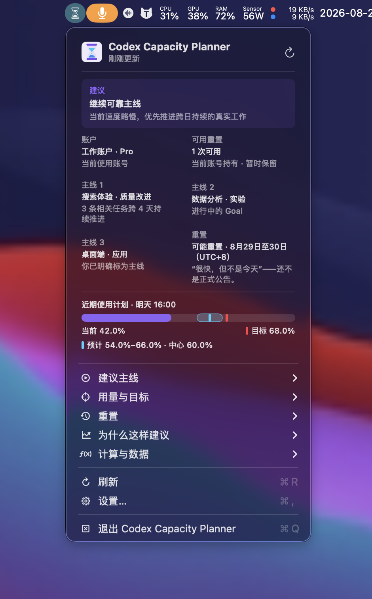
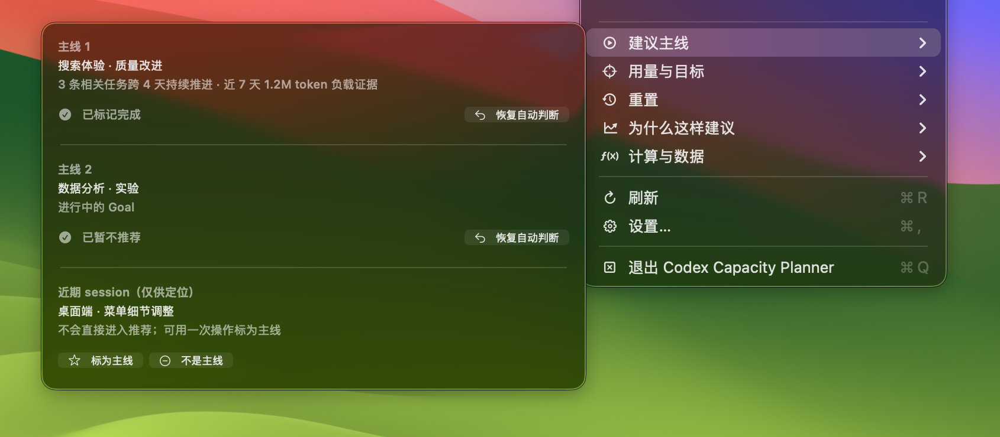
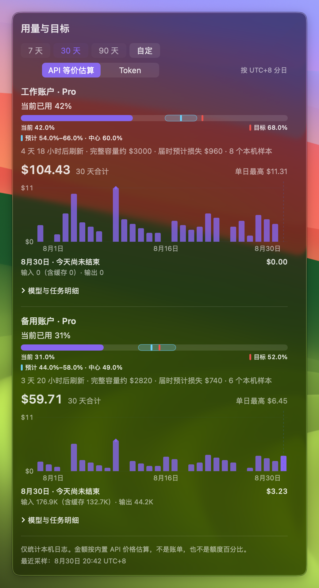
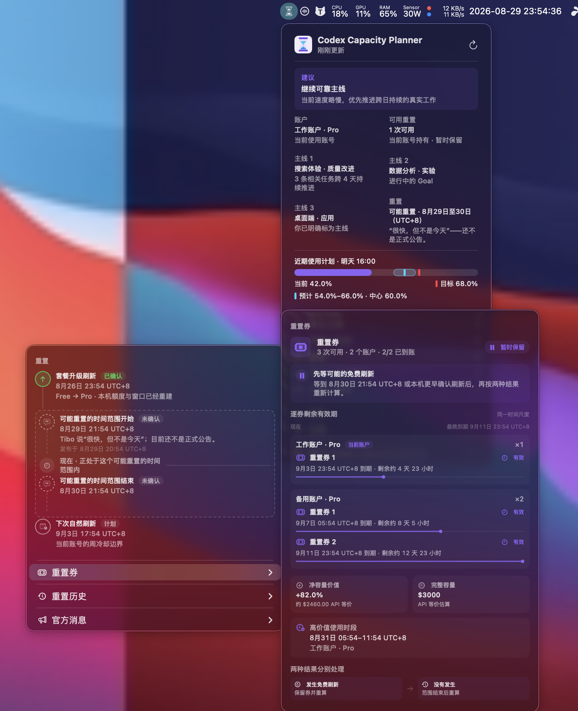
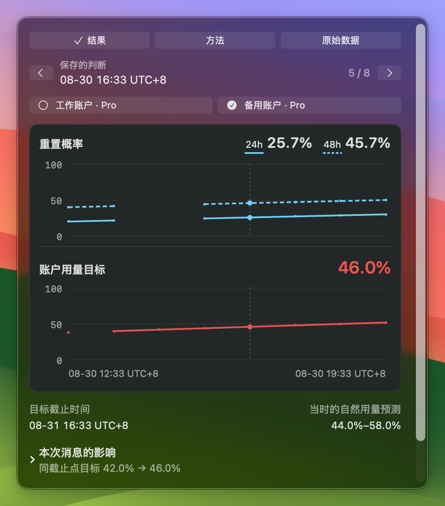
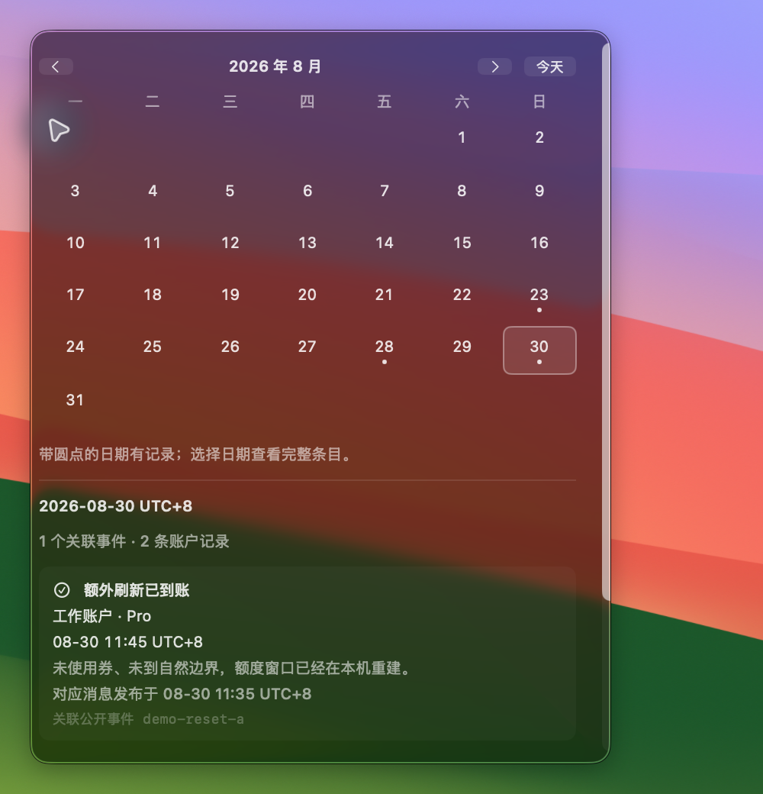

<p align="center">
  
</p>

<h1 align="center">Codex Capacity Planner</h1>

<p align="center"><strong>面向 Codex 用户的本地使用规划工具</strong></p>

<p align="center">
  结合当前额度、个人使用速度、近期工作、刷新信息和重置券，<br>
  为你提供工作节奏、账号使用与切换、重置券使用时机等建议。
</p>

<p align="center">
  帮助你更充分地利用每个周期的额度，并减少额度耗尽对工作的影响。
</p>

<p align="center">
  <a href="https://github.com/Yusong-Enceladus/codex-capacity-planner/releases/latest/download/Codex-Capacity-Planner-macOS.dmg"><strong>下载 macOS 版 DMG</strong></a>
  ·
  <a href="README.en.md">English</a>
</p>

<p align="center">
  
</p>

> 非 OpenAI 官方产品。本项目与 OpenAI 没有隶属或背书关系；Codex 是 OpenAI 的商标。

## 它能提供什么

- **使用计划**：显示当前用量、目标和预计用量，并提供保持或加速使用的建议。
- **近期工作建议**：主菜单直接提供最多 5/3/1 条逻辑主线及纠偏操作；每条主线的有效操作横排在同一行，点击后原位显示保存结果，菜单保持打开，支持连续操作和恢复自动判断。排序依据是明确标注、Goal 与跨日持续性，token 只作负载证据，临时 session 不会被拿来凑数。
- **重置管理**：按过去→现在→未来的时间轴统一显示自然刷新、可能重置的时间范围、官方重置、套餐升级和实际到账。
- **多账号支持**：“用量与目标”按账户显示当前、目标与预计区间，同时保留 API 等价容量、预计损失和本机采样来源。
- **每日用量历史**：每个账户进度条下直接显示日柱状图；共用 7/30/90 天切换，默认 30 天并记住上次选择，支持自定 1–365 天。可查看 API 等价估算或 Token、合计、单日峰值、选中日期及收起的模型/工作区/任务明细，操作不关闭菜单。
- **可解释计算**：“计算与数据”是独立一级入口，用“结果 / 方法 / 原始数据”页内切换。结果页集中显示同一时刻、同一账户的关键数字与对齐趋势；公式、完整记录和当前诊断分别展开，不再混成一长屏。
- **重置券规划**：逐张显示所属账户与各自到期时间；所有券共用从“现在”开始的时间尺度，剩余越久时间线越长，同时保留净容量价值、API 等价容量、高价值时段，以及“发生免费刷新/没有发生”的两种结果。

<p align="center">
  
</p>

<p align="center"><sub>连续标记完成、暂不推荐后，菜单保持打开；其余主线仍可操作，也可恢复自动判断。</sub></p>

<p align="center">
  
</p>

历史金额是本机日志的 API 等价估算，不是账单或额度百分比。中文按 UTC+8 分日，英文按太平洋时间分日；重置不会清除用量历史。旧日志如果没有可靠账号标识，会单列为“未归属的本机用量”，不会按当前登录账号猜测分配；空白日期不冒充零用量。365 天是可选范围，不保证已有同样长的可靠记录。

<p align="center">
  
</p>

<p align="center"><sub>截图来自实际构建并运行的 macOS 状态栏 App，使用匿名演示数据，不包含真实账号信息。</sub></p>

<details>
<summary><strong>核对消息影响与重置历史</strong></summary>

<p align="center"></p>
<p align="center"></p>

图中的每个历史点代表当时保存的判断；没有记录的过去不会补画。示例使用匿名合成数据，界面与正式应用共用实现。

菜单打开前按实际内容测高，短时间轴和建议说明不再预留大片空白；展开详情时在原位滚动，不关闭菜单。两张历史图共用时间刻度和选中位置，中文显示 UTC+8，英文显示太平洋时间。

</details>

## 一份统一的使用计划

当前额度、使用情况、近期工作、刷新信息和重置券共同形成一份使用计划。任一信息变化后，工作、账号和重置券建议会一起更新。

## 独立 App 与 CodexBar

macOS App 可以独立使用。通过仓库内的 CodexBar 集成构建时，两种界面读取同一份本机计划与建议。

App 会自动启动并连接内置的本机组件，升级后也会自动接管旧组件，不需要用户配置服务地址。主菜单把“建议主线、用量与目标、重置、为什么这样建议、计算与数据”固定放在“刷新、设置、退出”上方。

## 安装

1. 下载 [`Codex-Capacity-Planner-macOS.dmg`](https://github.com/Yusong-Enceladus/codex-capacity-planner/releases/latest/download/Codex-Capacity-Planner-macOS.dmg)。
2. 打开 DMG，把 `Codex Capacity Planner` 拖到同一窗口里的“Applications”快捷方式。
3. 第一次启动时，在“应用程序”中按住 Control 点按 App 并选择“打开”。若系统仍然阻止，请前往“系统设置 → 隐私与安全性”，核对应用名称后选择“仍要打开”。

当前下载版支持 Apple Silicon Mac，并已内置 Node.js、本机监控与采集组件；不需要另外安装 CodexBar、Node.js 或配置服务地址。Release 同时保留内容相同的 ZIP 和 `SHA256SUMS.txt`。由于仓库目前没有 Apple Developer ID，社区构建采用 ad-hoc 签名且未经 Apple 公证，因此首次打开仍需要上面的系统确认。

<details>
<summary><strong>从源码构建</strong></summary>

需要 macOS 14 或更高版本、Xcode / Swift 6.2 和 Node.js 22：

```sh
git clone https://github.com/Yusong-Enceladus/codex-capacity-planner.git
cd codex-capacity-planner
./CodexResetApp/build-app.sh
open "CodexResetApp/dist/Codex Capacity Planner.app"
```

Intel Mac 可以从源码构建对应架构版本。

</details>

## 隐私

额度、账号、刷新时间、预测和近期工作均在本机处理。主线识别会在本机读取任务标题与有界的首条消息/预览并立即转换为主题特征；原文不会进入规划器状态或本机展示 API。系统不读取回复正文、源代码、工具输出、认证令牌或浏览器 Cookie。

外部重置信号请求不会携带账号、邮箱、额度、个人刷新时间、任务信息或建议结果。默认信号来源 `codex-reset.com` 是独立第三方服务，不由本项目维护；不可用时，系统仍可根据本机额度、自然刷新和个人使用情况提供计划。

详见[隐私说明](docs/privacy.md)与[安全策略](SECURITY.md)。

## 当前支持范围

- 预构建版本支持 Apple Silicon 与 macOS 14 或更高版本；
- 建议仅供用户参考，系统不会自动执行任务、切换账号或使用重置券；
- 普通重置预测表示概率，明确公告与当前账号实际到账会分别显示；
- 沿用 [codex-reset.com](https://codex-reset.com/forecast-method) 的公开信号分级、分数和截止时间；基础概率与承诺权重分开，旧重置到账不会清掉另一条未来承诺。最晚时间显示为“之前”，不冒充准确到账时刻；
- “可能重置”的证据强度不冒充概率；重置页按过去→现在→未来显示最近确认刷新、可能重置的时间范围与下一次自然刷新。“现在”若落在该范围内，会直接显示在范围内部。中文时间统一为 UTC+8，英文统一为太平洋时间；
- 重置券会同时核对所有账号，并分别计算“可能发生免费刷新”和“没有发生免费刷新”两种结果；账号额度未同时确认或仍有可用容量时，不会建议立即兑换；
- 同一账户持有多张重置券时，每张券保留自己的发放与到期时间，不会用“最早到期”替代其余券的真实期限；
- 重置券的可视化表示“从现在到到期”的剩余时间，而不是已经过去的生命周期百分比；所有可见券使用同一时间尺度，因而较晚到期的券一定显示得更长；
- 主页内容会自然换行并完整显示，时间、时区与建议结论不会用省略号截断；
- 重置消息可核对“收到时间 → 系统解读 → 每账户计划 → 实际到账”。消息没有改变计划时也会说明原因；前后比较固定评估时间和账户数据，不把时间流逝当成消息影响；
- “计算与数据”在同页切换结果、方法和原始数据；重置概率、信号权重与账户用量目标分开展示。历史页可选日期看逐条记录，同一公开事件不会因两个账户到账而重复计数；
- 判断历史只在本机保存，从真实观察开始积累；来源失败留空，不显示成零概率。WillCodexReset 仅作为产品参考，目前没有自动接入其数据；
- Codex 额度规则变化后，相关计算可能需要更新。

## 技术文档

- [架构与决策边界](docs/architecture.md)
- [容量基线与个人校准](docs/capacity-baselines.md)
- [外部信号契约](docs/signal-contract.md)
- [可核对的判断与历史记录](docs/decision-history.md)
- [macOS 分发与安装边界](docs/distribution.md)
- [贡献指南](CONTRIBUTING.md)

项目以 [MIT License](LICENSE) 开源。第三方代码与许可说明见 [NOTICE](NOTICE)。
